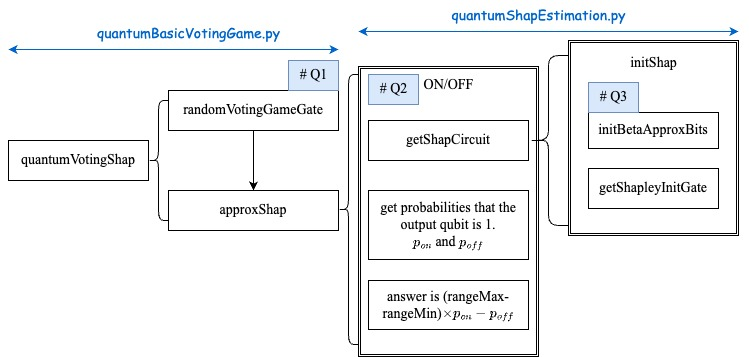
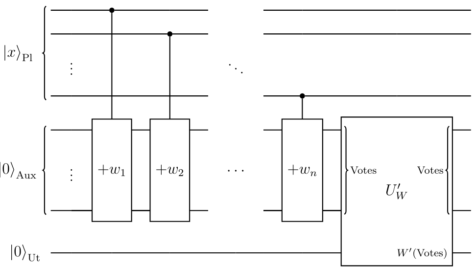

# Overview



The picture above shows the sequence of function calls to solve a voting game in code.

`quantumVotingShap` is the entry function.

```python
quantumVotingShap(threshold=threshold, playerVals=playerVals, ell=ell)
```

I have several questions in some functions. My questions can be summarized as follows:

- Why the output qubit (stored in `utilityReg` in code) shares the qubit with `voteReg`?
- Why the $U_W$ gate is not applied to the output qubit before the final measurement as the paper claimed? Instead, the shapley value is calculated by the probablities that the output qubit is 1 when the target qubit is `ON` and `OFF` in code.
- Why the weight to apporxing $\beta(n,m)$ is not as described in the paper?

# Question 1

We first call `randomVotingGameGate` to generate the gate for counting the votes, which is like the following pattern.

```
q_0: ─────■────────────────
          │
q_1: ─────┼──────────■─────
     ┌────┴────┐┌────┴────┐
q_2: ┤0        ├┤0        ├
     │         ││         │
q_3: ┤1 c(1)+1 ├┤1 c(1)+3 ├
     │         ││         │
q_4: ┤2        ├┤2        ├
     └─────────┘└─────────┘
```

Some quantum registers are defined at the beginning of the function.

```python
playerReg: list[int] = np.arange(len(playerVals)).tolist()
voteReg = np.arange(len(playerVals), len(playerVals) + thresholdBits).tolist()
allReg = playerReg + voteReg
utilityReg = [len(playerVals)]
circuit = QuantumCircuit(len(playerReg) + len(voteReg))
```

As the figure illustrated in the paper, the `utilityReg` ($U_t$) is a standalone register. But it shares the qubit with `voteReg` in code, which is the first qubit in `voteReg`.



**Here comes the first question.** Why `utilityReg` and `voteReg` share the qubit?

# Question 2

After calling `randomVotingGameGate`, the shapley value is apporxed by `approxShap`. The quantum circuit is constructed first by calling `getShapCircuit`. In this function, the circuits to generate quantum state $|\psi\rangle_1$ and $|\psi\rangle_2$ metioned in the paper are constructed by calling `initBetaApproxBits` and `getShapleyInitGate`, but the $U_W$ gate to generate $|\psi\rangle_3$ is not. Instead, the target qubit is divided into two states `ON` and `OFF`. The probablities that the output qubit is $1$ are measured in each state and then used to calculating the result: $\text{(rangeMax-rangeMin)} \times (p_{on}-p_{off})$.

**Here comes the second question.** Why did the code and the paper use different calculations? In my humble opinion, measuring the output qubit in the ON or OFF states yields the probability that the votes exceed the threshold when the target is in or not in the set. What is the special purpose of this?

# Question 3

**The third problem is about the detail in `initBetaApproxBits`.** The weight is calculated in code as follows.

```python
auxWeights = np.arange(L)
auxWeights = np.sin(np.pi * (2 * auxWeights + 1) / (2 * L))
auxWeights = auxWeights / np.sum(auxWeights)
auxWeights = np.sqrt(auxWeights)
auxWeights = auxWeights.astype("complex128")
```

But in the paper, the weight is

$$
\sqrt{w_l(k)}=\sqrt{t_l(k+1)-t_l(k)}=\sqrt{
\sin\left(\frac{\pi(2k+1)}{2^{l+1}}\right)
\sin\left(\frac{\pi}{2^{l+1}}\right)
},
$$

which is different form the one in code. Why is this?
