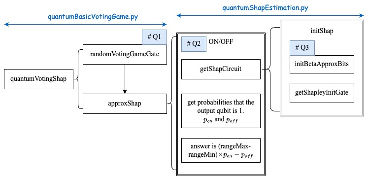
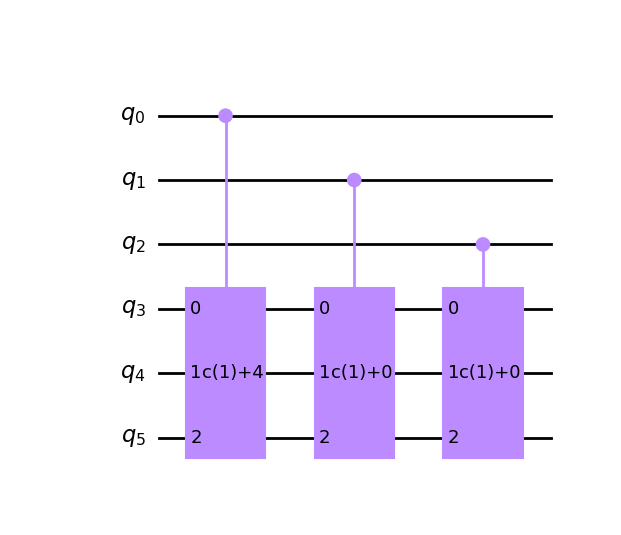
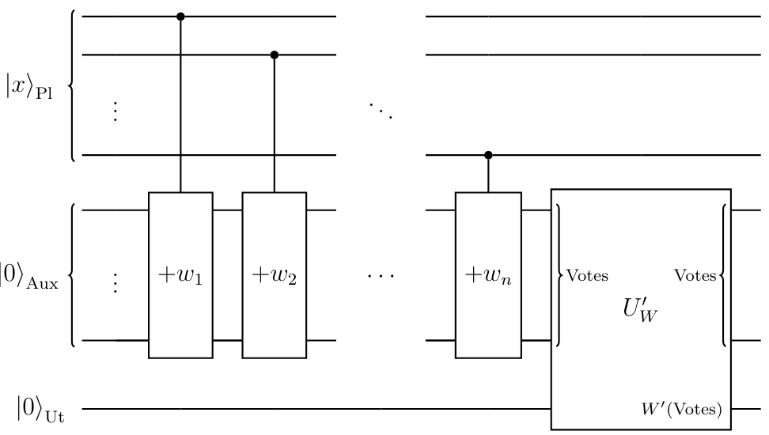

# Overview



Figure 1 shows the sequence of function calls to solve a voting game in code.

`quantumVotingShap` is the entry function.

```python
quantumVotingShap(threshold=threshold, playerVals=playerVals, ell=ell)
```

My questions can be summarized as follows:

- Why the output qubit (stored in `utilityReg` in code) shares the qubit with `voteReg`?
- Why the $U_W$ gate is not applied to the output qubit before the final measurement as the paper claimed? Instead, the shapley value is calculated by the probablities that the output qubit is 1 when the target qubit is `ON` and `OFF` in code.
- Why the weight to apporxing $\beta(n,m)$ is not as described in the paper?

# Question 1

We first call `randomVotingGameGate` to generate the gate for counting the votes, which is like the pattern shown in Figure 2.



Some quantum registers are defined at the beginning of the function.

```python
playerReg: list[int] = np.arange(len(playerVals)).tolist()
voteReg = np.arange(len(playerVals), len(playerVals) + thresholdBits).tolist()
allReg = playerReg + voteReg
utilityReg = [len(playerVals)]
circuit = QuantumCircuit(len(playerReg) + len(voteReg))
```

As Figure 3 illustrated in the paper, the `utilityReg` ($U_t$) is a standalone register. But it shares the qubit with `voteReg` in code, which is the first qubit in `voteReg`.



**Here comes the first question.** Why `utilityReg` and `voteReg` share the qubit?

# Question 2

After calling `randomVotingGameGate`, the shapley value is apporxed by `approxShap`. First, the quantum circuit is constructed by calling `getShapCircuit`. In this function, the circuit module to generate quantum state $|\psi\rangle_1$ and $|\psi\rangle_2$ metioned in the paper are constructed by calling `initBetaApproxBits` and `getShapleyInitGate`, but the $U_W$ gate to generate $|\psi\rangle_3$ is not. Instead, the target qubit is divided into two states `ON` and `OFF`. The probablities that the output qubit is $1$ are measured in each state and then used to calculating the result: $\text{(rangeMax-rangeMin)} \times (p_{on}-p_{off})$.

**Here comes the second question.** Why did the code and the paper use different calculations? In my humble opinion, measuring the output qubit in the `ON` or `OFF` state yields the probability that the votes exceed the threshold when the target is in or not in the set. What is the special purpose of this?

# Question 3

**The third problem is about the detail in `initBetaApproxBits`.** The weight is calculated in code as follows.

```python
auxWeights = np.arange(L)
auxWeights = np.sin(np.pi * (2 * auxWeights + 1) / (2 * L))
auxWeights = auxWeights / np.sum(auxWeights)
auxWeights = np.sqrt(auxWeights)
```

But in the paper, the weight is

$$
\sqrt{w_l(k)}=\sqrt{t_l(k+1)-t_l(k)}=\sqrt{
\sin\left(\frac{\pi(2k+1)}{2^{l+1}}\right)
\sin\left(\frac{\pi}{2^{l+1}}\right)
},
$$

which is different form the one in code. Why is this?
